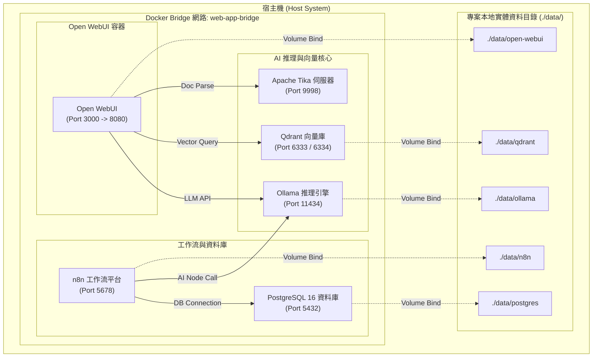
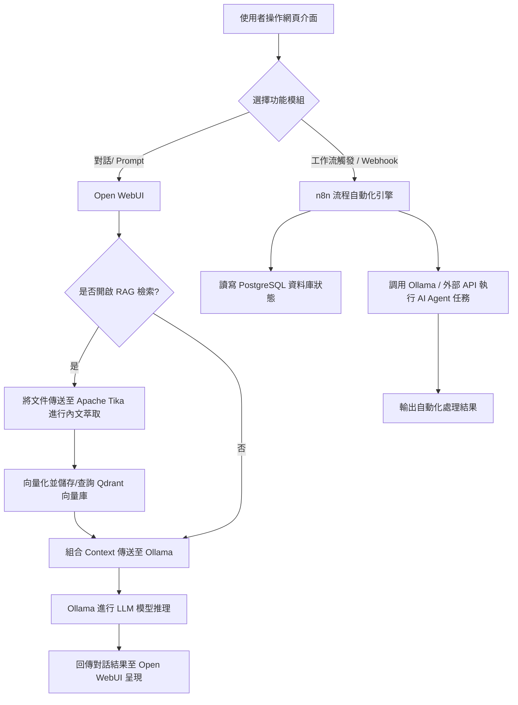
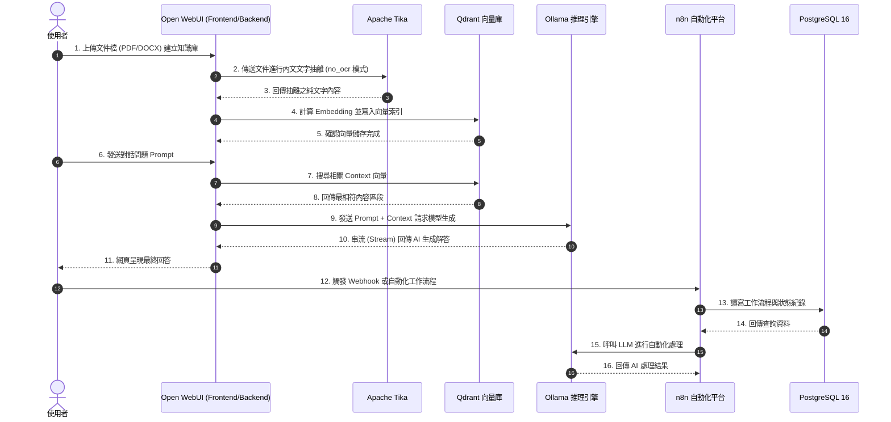

# ai-tools-compose


`ai-tools-compose` 是一個整合大語言模型 (LLM) 推理、向量檢索 (RAG)、工作流自動化 (Automation) 及多格式文件文字抽離的微服務 Docker 容器堆疊方案。透過本專案，開發者與企業可快速於本機或伺服器建置一站式 AI 工具開發與運行環境。

---

## 1. 專案簡介 (Description)

本專案整合 6 大核心微服務：
- **Ollama**: 本地大語言模型 (LLM) 推理引擎，支援 Llama 3, Qwen, Mistral 等模型。
- **Qdrant**: 高效能向量資料庫 (Vector Database)，提供 RAG 語意檢索與向量檢索功能。
- **Open WebUI**: 現代化 Web 聊天圖形介面，整合 Ollama 模型、Qdrant 向量庫與 Tika 文件解析。
- **PostgreSQL 16**: 關聯式資料庫，作為 n8n 工作流引擎之核心資料儲存庫。
- **n8n**: 流程自動化與 AI Agent 流程編排平台，支援節點式串接與自動化任務執行。
- **Apache Tika**: 文件文本擷取伺服器，自動解析 PDF、Word 等格式並優化 RAG 前處理。

---

### 1.1 系統架構圖 (System Architecture)



---

### 1.2 系統流程圖 (System Flowchart)



---

### 1.3 系統時序圖 (Sequence Diagram)



---

## 2. 安裝與建置指南 (Installation and Setup)

### 2.1 系統環境需求
在安裝本專案前，請確保系統已安裝以下軟體：
- **Docker Desktop** (Windows / macOS) 或 **Docker Engine** 20.10+ (Linux)
- **Docker Compose** V2 (`docker compose` 指令)
- **Git**

### 2.2 專案複製與初始化
1. **複製專案庫**:
   ```bash
   git clone https://github.com/dengkaitraining/ai-tools-compose.git
   cd ai-tools-compose
   ```

2. **建立外部 Docker 橋接網路** (首次執行需建立):
   ```bash
   docker network create web-app-bridge
   ```

3. **建立環境變數設定檔**:
   複製 `.env.example` 為 `.env`，並調整自訂金鑰與密碼：
   ```bash
   cp .env.example .env
   ```

---

## 3. 設定說明 (Configuration)

### 3.1 環境變數 (`.env`)
專案提供完整簡潔之 `.env` 變數設定，主要參數如下：

| 分類 | 變數名稱 | 預設值 / 建議值 | 說明 |
| :--- | :--- | :--- | :--- |
| **Ollama** | `OLLAMA_DOCKER_TAG` | `latest` | Ollama 容器映像檔版本 |
| | `OLLAMA_BASE_URL` | `http://ollama:11434` | Open WebUI 連接 Ollama 之內部網址 |
| **Open WebUI** | `WEBUI_DOCKER_TAG` | `main` | Open WebUI 容器映像檔版本 |
| | `WEBUI_SECRET_KEY` | `(隨機密碼)` | 用於 Session/Cookie 加密之金鑰 |
| | `ENABLE_SIGNUP` | `False` | 是否開放新使用者自由註冊 |
| **Qdrant** | `VECTOR_DB` | `qdrant` | 指定向量資料庫類型 |
| | `QDRANT_URI` | `http://qdrant:6333` | Qdrant 內部 REST API 位址 |
| | `QDRANT_API_KEY` | `(自訂密碼)` | Qdrant 管理者 API 金鑰 |
| **Tika** | `TIKA_SERVER_URL` | `http://tika:9998` | Tika 文件解析伺服器內部網址 |
| **PostgreSQL** | `POSTGRES_USER` | `root` | PostgreSQL 管理者帳號 |
| | `POSTGRES_PASSWORD` | `@7YgV5tHn,.` | PostgreSQL 管理者密碼 |
| | `POSTGRES_DB` | `n8n` | 預設建立之資料庫名稱 |
| **n8n** | `N8N_DOMAIN_NAME` | `localhost` | n8n 服務網域名稱 |
| | `N8N_WEBHOOK_URL` | `https://your-domain.com/` | n8n 外部 Webhook 呼叫位址 |
| | `GENERIC_TIMEZONE` | `Asia/Taipei` | 系統與排程運作時區 |

### 3.2 實體目錄資料持久化 (Volume Persistence)
所有微服務容器資料均掛載至專案內部的實體相對目錄 `./data/`：
- `./data/ollama`: 儲存下載之 Ollama LLM 模型與快取。
- `./data/qdrant`: 儲存 Qdrant 向量索引與資料庫檔。
- `./data/open-webui`: 儲存 Open WebUI 使用者設定與 SQLite 庫。
- `./data/postgres`: 儲存 PostgreSQL 16 資料庫檔案。
- `./data/n8n`: 儲存 n8n 工作流程、金鑰與憑證。

### 3.3 跨平台相容性處理 (Linux & Windows)
- **`N8N_ENFORCE_SETTINGS_FILE_PERMISSIONS=false`**: 在 Windows NTFS 主機掛載實體目錄時，停用 strict POSIX 權限檢查以避免容器啟動崩潰。
- **`.gitattributes`**: 設定 `*.sh text eol=lf`，確保 Shell 腳本 (`init-data.sh`) 在 Windows clone 時維持 Unix LF 格式，避免 `/bin/bash` 報錯 `\r: command not found`。

---

## 4. 執行與啟動本地服務 (Usage / Getting Started)

### 4.1 啟動容器服務
使用以下指令在背景啟動所有微服務：
```bash
docker compose up -d
```

### 4.2 檢查容器運作狀態
```bash
docker compose ps
```

### 4.3 檢視服務即時日誌 (Logs)
```bash
docker compose logs -f
```

### 4.4 停止與關閉服務
```bash
docker compose down
```

### 4.5 服務存取端點 (Endpoints)
容器啟動完成後，可透過瀏覽器存取以下服務：

| 服務名稱 | 存取網址 / 端點 | 預設預設說明 |
| :--- | :--- | :--- |
| **Open WebUI** | [http://localhost:3000](http://localhost:3000) | 圖形化對話與 RAG 管理介面 |
| **n8n 工作流** | [http://localhost:5678](http://localhost:5678) | 工作流自動化與 AI Agent 編輯器 |
| **Qdrant Dashboard** | [http://localhost:6333/dashboard](http://localhost:6333/dashboard) | 向量資料庫控制台 |
| **Ollama API** | [http://localhost:11434](http://localhost:11434) | Ollama REST API 端點 |
| **Apache Tika** | [http://localhost:9998](http://localhost:9998) | Tika 文件萃取 REST Server |
| **PostgreSQL 16** | `localhost:5432` | 關聯式資料庫服務端點 |

---

## 5. 資料夾結構與架構簡述 (Project Structure)

```
ai-tools-compose/
├── .agents/                      # Agent 任務紀錄與 Prompt 日誌
│   └── task_logs/                # 標準任務執行紀錄檔
│       ├── 01_implementation_plan.md
│       ├── 02_task_list.md
│       └── 03_walkthrough.md
├── data/                         # [已忽略] 容器實體資料持久化目錄
│   ├── n8n/                      # n8n 工作流與設定
│   ├── ollama/                   # Ollama 大模型檔與快取
│   ├── open-webui/               # Open WebUI 帳號與對話庫
│   ├── postgres/                 # PostgreSQL 資料庫檔案
│   └── qdrant/                   # Qdrant 向量庫檔案
├── docs/                         # 專案相關文件與參考說明
├── local-files/                  # n8n 容器共用本機檔案交換目錄
├── tika-config.xml/              # Apache Tika 自訂設定檔目錄
│   └── tika-config.xml           # PDF 停用 OCR 效能設定檔
├── .env                          # [已忽略] 環境變數設定檔
├── .env.example                  # 環境變數範本檔
├── .gitattributes                # Git 跨平台換行符規則設定檔
├── .gitignore                    # Git 忽略檔案設定
├── Dockerfile                    # Open WebUI 多階段建置檔
├── docker-compose.yaml           # Docker Compose 微服務編排主設定檔
├── init-data.sh                  # PostgreSQL 初始化非 Root 使用者腳本
└── README.md                     # 專案說明文件
```

---

## 6. 系統測試與驗證 (System Testing and Verification)

### 6.1 Compose 語法驗證
執行以下指令驗證 `docker-compose.yaml` 與 `.env` 變數解析是否無誤：
```bash
docker compose config
```

### 6.2 服務健康檢查測試
- **PostgreSQL 16**:
  ```bash
  docker compose exec postgres pg_isready -h localhost -U root -d n8n
  ```
- **Open WebUI**:
  ```bash
  curl -I http://localhost:3000
  ```
- **Ollama API**:
  ```bash
  curl http://localhost:11434/api/tags
  ```

---

## 7. 貢獻與授權 (Contributing and License)

### 貢獻指南
歡迎提出 Issue 或發起 Pull Request！改善內容可包含服務升級、新 AI 模組整合或文件優化。

### 授權條款 (License)
本專案採用 [MIT License](LICENSE) 授權釋出。